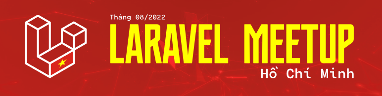

# Laravel Vietnam Meetup (Hồ Chí Minh)

## Thời gian và địa đểm

- Thời gian: 9:00 AM, ngày 07/08/2022 (Chủ Nhật)
- Tại: Tòa Nhà K-Group, 12B Nguyễn Hữu Cảnh, P. 19, Q. Bình Thạnh, Hồ Chí Minh ([Link Google Maps](https://goo.gl/maps/8YKYzPNKYK3TsDdZ6))
- Đăng ký tại: [forms.gle](https://forms.gle/CMv84KBG9D6zXniu5)

## Chủ đề

### 1. Xây Dựng Laravel Theo Dạng Packages

_Sẽ ra sao nếu dự án Laravel của chúng ta được cấu trúc theo packages thay vì theo cấu trúc tiêu chuẩn của Framework, ưu và nhược điểm của nó sẽ như thế nào?! Sẽ được đề cập trong chủ đề này._

**Nguyễn Minh Sang** - Creator of Botble, Admin at Laravel Việt Nam

### 2. Monolithic Đa Kiến Trúc & Định Hướng Phát Triển Microservices

_Đặt vấn đề là sản phẩm công ty muốn triển khai theo kiến trúc microservices nhưng vì nguồn lực chưa đủ nên muốn triển khai trước theo hướng monolithic nhưng vẫn phải tuân thủ các quy tắc để có thể chuyển đổi lên microservices, chúng ta có một số vấn đề cần thảo luận để có thể đạt được các mục tiêu này._

**Lưu Thanh Sang** - Team Leader at Getfly

### 3. Code của bạn ĐƠN GIẢN hay PHỨC TẠP?

_Bạn đang viết code trong ứng dụng Laravel như thế nào, liệu nó có hợp lý không, có khó hiểu hay phức tạp quá hay không, bạn có kiểm soát được nó hay không, chúng ta sẽ cùng thảo luận về vấn đề này nhé._

**Đinh Quốc Hân** - Software Engineer at SHIFT ASIA, Admin at Laravel Việt Nam

### 4. Event Driven Architecture - Event Sourcing

_Kiến trúc hướng Event và một số mẫu thiết kế thường áp dụng (Event Sourcing, CQRS)_

Nguyễn Thế Huy - Software Engineer at GHTK

### 5. Cache Và Cách Quản Lý Cache Hiệu Quả Trong Laravel

_Trong chủ đề này, chúng ta cùng thảo luận về sử dụng Cache và quản lý cache hiệu quả trong Ứng dụng Laravel._

**Phạm Kỳ Khôi** - Founder at SUNTECH VIỆT NAM

### 6. Chuyện Lương Ngành IT

_Chưa có mô tả cụ thể._

**Bùi Văn Nguyện** - Founder at Tech2 Solutions

## Lưu ý

- Sự kiện hoàn toàn miễn phí
- BTC có chuẩn bị nước suối
- Vì sự kiện tổ chức cả ngày, nên sẽ có nghỉ trưa 1 giờ, mọi người nghỉ ngơi và ăn trưa tự túc nhé

## Nhà tài trợ

### Nhà tài trợ chính

**Công ty CP Giải Pháp Số FunnyDev., Jsc**

- [www.funnydev.vn](https://www.funnydev.vn)
- Chúng mình là một startup mới trong lĩnh vực CNTT, với đam mê về phát triển phần mềm máy tính và nhiệt huyết trong lĩnh vực, chúng mình đã cho ra đời và hiện đang kinh doanh các sản phẩm phần mềm máy tính hỗ trợ cho việc kiếm tiền trực tuyến, đồng thời phát triển nhiều tiện ích miễn phí trong các lĩnh vực khác nhau như y tế, giáo dục, quản trị nhân sự... Ngoài ra chúng mình còn kinh doanh dịch vụ máy chủ ảo nguồn từ Google Cloud, AWS... trong đó đã ra mắt các hosting phù hợp với các lập trình viên mới hoặc sinh viên đang học tập bằng hình thức miễn phí hoàn toàn, chi tiết hãy tham khảo tại https://funnydev.cloud nhé.

**Công ty Cổ phần Giao Hàng Tiết Kiệm**

- [www.giaohangtietkiem.vn](https://giaohangtietkiem.vn)

## Đồng tài trợ

1. Công ty TNHH Lưu Trữ Số - 123HOST
- [www.123host.vn](https://123host.vn)
