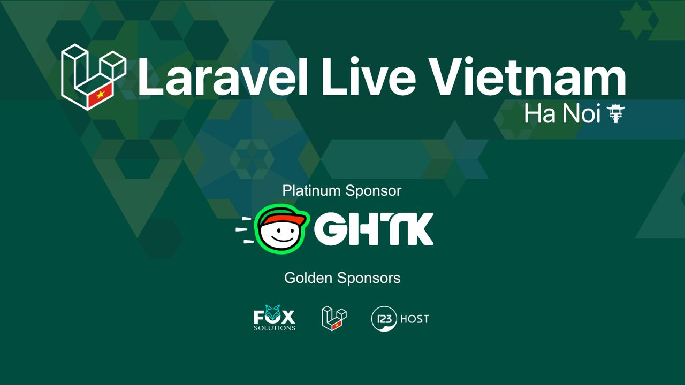

# Sự Kiện Laravel Live Việt Nam (tại Hà Nội)

## Thời gian và địa đểm

- Thời gian: 9:00 AM, ngày 04/12/2022 (Chủ Nhật)
- Tại: Tại: The Vuon - D2 Giảng Võ, Ba Đình, Hà Nội ([Link Google Maps](https://goo.gl/maps/gmha9gBZTRNWWsgN8))
- Đăng ký tại: [forms.gle]( https://forms.gle/XAcCjLF5HMzo7wjK9)

## Chủ đề

### 1. Laravel Eloquent Performance

_Descriptions is updating_

> Youtube Video : Comming soon

**Đinh Quốc Hân** - Software Engineer at SHIFT ASIA, Admin at Laravel Việt Nam

### 2. Concurrency in PHP and Laravel

_Descriptions is updating_

> Youtube Video : Comming soon

**Nguyễn Thế Huy** - Software Engineer, Tech Leader at GHTK

### 3. Schema design for relational database 

_Descriptions is updating_

> Youtube Video : Comming soon

**Mr. Phan Hồng Lĩnh** - Tech Leader at GHTK

## Lưu ý

- Sự kiện hoàn toàn miễn phí
- BTC có chuẩn bị nước suối

## Nhà tài trợ

### Nhà tài trợ chính

**Công ty Cổ phần Giao Hàng Tiết Kiệm**

- Công ty Cổ phần Giao Hàng Tiết Kiệm (GHTK) là công ty công nghệ hoạt động kinh doanh trong lĩnh vực bưu chính. Ưu thế của Giaohangtietkiem là tốc độ nhanh, mạng lưới phủ rộng trên toàn quốc và đặc biệt là thế mạnh trong việc nghiên cứu và ứng dụng công nghệ mới phục vụ cho hoạt động bưu chính. GHTK tin rằng dịch vụ này là hữu ích cho xã hội nói chung. Người bán hàng bán được nhiều hơn, khách hàng mua sắm thoải mái hơn, và người giao hàng có thêm nhiều công việc và thu nhập xứng đáng.

- Năm 2022, GHTK vô cùng vinh dự và tự hào khi được công nhận là Thương hiệu Quốc gia Việt Nam, đánh dấu vị thế trong ngành e-logistics, là đơn vị vận chuyển uy tín, có chất lượng dịch vụ vượt trội và nhận được sự tin yêu của hàng triệu nhà bán lẻ tự lực; với hơn một tỷ đơn hàng phục vụ hơn bảy mươi triệu người tiêu dùng trên khắp lãnh thổ Việt Nam.

- Trang chủ chính thức của GHTK: [www.giaohangtietkiem.vn](https://giaohangtietkiem.vn)

## Đồng tài trợ

1. FOX Solutions
    
- FOX Solutions - Đội ngũ cung cấp giải pháp và gia công phần mềm chuyên nghiệp, uy tín và chất lượng. Dẫn đầu xu hướng công nghệ, tối ưu đáp ứng tốt các nhu cầu của khách hàng.

- Trang chủ chính thức của Fox Solutions: [www.foxsolutions.vn](https://foxsolutions.vn)

2. Công ty TNHH Lưu Trữ Số - 123HOST

- Công ty TNHH Lưu Trữ Số – Thương hiệu 123HOST là công ty cung cấp dịch vụ Hosting, Tên miền, Máy chủ và các giải pháp INTERNET hàng đầu Việt Nam. Được thành lập từ năm 2012 với đội ngũ trẻ, năng động và chuyên nghiệp.

- Trang chủ chính thức của 123HOST: [www.123host.vn](https://123host.vn)
