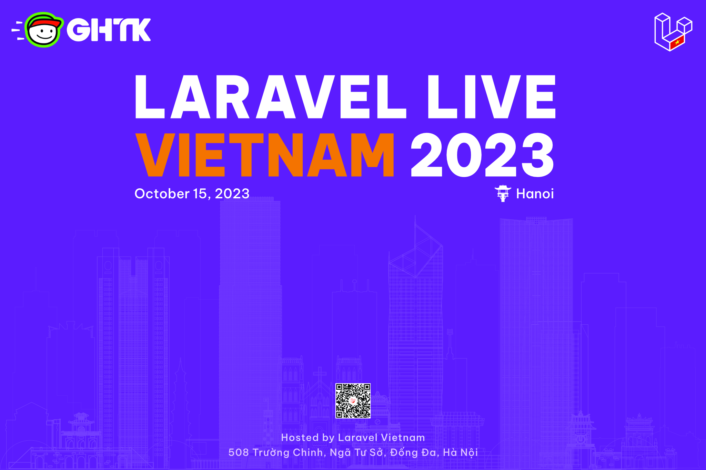

# Sự Kiện Laravel Live Việt Nam (tại Hà Nội)

## Thời gian và địa đểm

- Thời gian: 13:00, ngày 15/10/2023 (Chủ Nhật)
- Tại: Tại: Tòa iMedia Tower, 508 Trường Chinh, Ngã Tư Sở, Đống Đa, Hà Nội ([Link Google Maps](https://maps.app.goo.gl/gUsUQbeuLXA5ZMQ17))
- Đăng ký tại: [forms.gle](https://forms.gle/e1B8RFtPNnFMnKXN8)

## Chủ đề

### 1. Laravel 2023 và Developer Laravel 2023 bạn nên làm gì?

**Đinh Quốc Hân** - Co-Founder/CTO at ARCHI ELITE, Admin at Laravel Việt Nam

### 2. Phân tích các design pattern trong Laravel

**Lưu Thanh Sang** - Founder at Người Viết Mã (NVM Community)

### 3. Kiến trúc ứng dụng Laravel dễ dàng mở rộng cho logic phức tạp

**Nguyễn Thế Huy** - Software Engineer, Technical Lead at GHTK

## Lưu ý

- Sự kiện hoàn toàn miễn phí
- Vui lòng nhập form để giữ chỗ, số lượng có hạn, chúng tôi sẽ đóng form khi đủ số lượng

## Nhà tài trợ

### Nhà tài trợ chính

**Công ty Cổ phần Giao Hàng Tiết Kiệm**

- Công ty Cổ phần Giao Hàng Tiết Kiệm (GHTK) là công ty công nghệ hoạt động kinh doanh trong lĩnh vực bưu chính. Ưu thế của Giaohangtietkiem là tốc độ nhanh, mạng lưới phủ rộng trên toàn quốc và đặc biệt là thế mạnh trong việc nghiên cứu và ứng dụng công nghệ mới phục vụ cho hoạt động bưu chính. GHTK tin rằng dịch vụ này là hữu ích cho xã hội nói chung. Người bán hàng bán được nhiều hơn, khách hàng mua sắm thoải mái hơn, và người giao hàng có thêm nhiều công việc và thu nhập xứng đáng.

- Năm 2022, GHTK vô cùng vinh dự và tự hào khi được công nhận là Thương hiệu Quốc gia Việt Nam, đánh dấu vị thế trong ngành e-logistics, là đơn vị vận chuyển uy tín, có chất lượng dịch vụ vượt trội và nhận được sự tin yêu của hàng triệu nhà bán lẻ tự lực; với hơn một tỷ đơn hàng phục vụ hơn bảy mươi triệu người tiêu dùng trên khắp lãnh thổ Việt Nam.

- Trang chủ chính thức của GHTK: [www.giaohangtietkiem.vn](https://giaohangtietkiem.vn)

**Sự kiện được tổ chức bởi Laravel Việt Nam**
