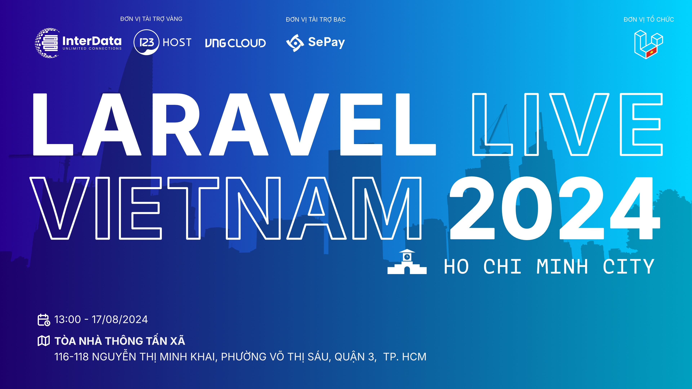

# Sự Kiện Laravel Live Việt Nam (tại Hồ Chí Minh)

## Thời gian và địa đểm

- Thời gian: 13:00, ngày 17/08/2024 (Thứ Bảy)
- Tại: TÒA NHÀ THÔNG TẤN XÃ, Số 116-118 Nguyễn Thị Minh Khai, Phường Võ Thị Sáu, Quận 3, Tp. Hồ Chí Minh ([Link Google Maps](https://maps.app.goo.gl/peqWfvXNASNaKZxc8))
- Đăng ký tại: (kết thúc đăng ký giữ chỗ)

## Chủ đề

- Cập nhật 3 chủ đề và 1 chương trình sẽ được thảo luận tại sự kiện của nhóm vào tháng 08 📣
Phỏng vấn Senior Developer và những kinh nghiệm không nên bỏ qua - Duy Phan (Justin Phan) - Senior SE - CBTW
- Anti-DDoS cho website vừa và nhỏ - Đức Đỗ (Đức Đỗ) - Senior SE @ Zalo
- Laravel - The Past & The Future - Hân Đinh (Đinh Quốc Hân) - Founder @ Archi Elite \w Huy Nguyễn (Nguyễn Thế Huy) - Technical Lead @ GHTK
- Giao lưu với BQT của Laravel Việt Nam, hỏi đáp tất tần tật

## Lưu ý

- Sự kiện hoàn toàn miễn phí
- Vui lòng nhập form để giữ chỗ, số lượng có hạn, chúng tôi sẽ đóng form khi đủ số lượng

## Nhà tài trợ độc quyền

### Cảm ơn đơn vị tài trợ Vàng:

* CÔNG TY CỔ PHẦN INTERDATA
* CÔNG TY TNHH LƯU TRỮ SỐ
* VNG CLOUD

### Cảm ơn đơn vị tài trợ Bạc:

* CÔNG TY CỔ PHẦN SEPAY

**Sự kiện được tổ chức bởi Laravel Việt Nam**
