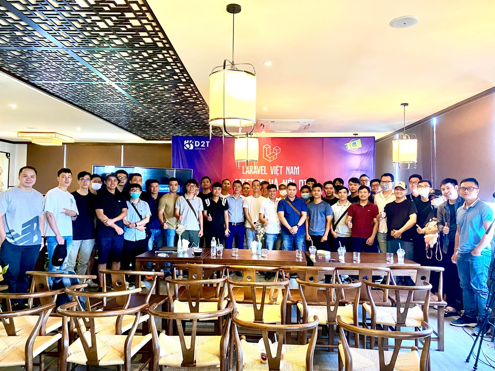

# Laravel Vietnam Meetup Wiki

Đây là project để lưu trữ, thông báo các buổi meetup của cộng đồng Laravel Việt Nam.

## Giới Thiệu

Năm 2022 là năm bắt đầu các buổi meetup đầu tiên của cộng đồng Laravel Việt Nam, là nơi dành cho tất cả các bạn từ newbie đến có kinh nghiệm Laravel ở Việt Nam.

Ở meetup, ngoài các chủ đề liên quan đến Laravel, còn có các bài thuyết trình, workshops chủ đề khác liên quan đến công nghệ website, thiết kế hệ thống, kinh nghiệm làm việc... được gặp gỡ các developers khác, giao lưu, tìm hiểu về các dự án hấp dẫn cũng như cơ hội việc làm tìm năng.

Tham gia vào nhóm ngay, bạn sẽ trở thành một phần của chúng mình, được nhận các thông tin sớm nhất từ nhóm, sự trợ giúp đến từ các thành viên trong group.

## Meetup

### 2022

- [Laravel Meetup 07/2022 (Hà Nội)](2022/07/03-07-2022-HN.md)

## Liên Kết

- [FB Group](https://www.facebook.com/groups/vietnam.laravel)
- [Github](https://github.com/laravel-vietnam)
- [Telegram](https://t.me/vietnam_laravel)
